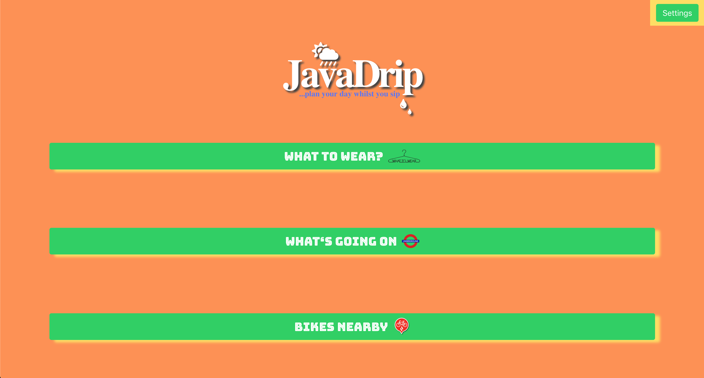

#  Software Engineering Immersive Project #2: JavaDrip

Project 2 by:  Cliff Conolly & Tom Tidswell

## Introduction
The premise of the app is to give you a quick glimpse of the Tube service and the weather; tips on what to wear given the temperature. In addition it also tells of you of the available Santander bikes that are closest to you, by using your postcode that you would have entered.


## Team Members
- Tom Tidswell - https://github.com/tomtidswell/
- Cliff Conolly - https://github.com/Cliff-Conolly/  


## Timeframe:
2 days (June 2019)

## Technologies used:
* JavaScript (ES6)
* HTML5
* CSS
* GitHub


## Overview

1.	The user is greeted on the Home Page with the options to choose from in the top right corner.	The user selects the setting for the city that they are in. At the moment there are only 5 major UK cities that the API is pulling data from:

* London
* Manchester
* Leeds
* Bristol
* Glasgow




2.	Once a location and postcode is set, the user will save it to their profile. When they hit the 'Plan Your Day' button the following options will appear:

        * a.) What to wear?

            API: OpenWeatherMap (https://openweathermap.org/api)

            The suggestions of material and clothing is dependent on the range of temperature in increments of 10° (0° - 10 etc.) in which the temperature for the users current location was pulled from the API. The suggestions for clothing were based upon a manual input that is a if/else function. Research was done to see what materials and clothing are suited for the respective 10° temp ranges, and depending on the temperature that was pulled in from the API the function would then suggest what to wear where in the range that the current temperature fell.

            

        * b.) Travel Status

            API: TFL (https://api.tfl.gov.uk): Line

            The Tube schedule is consumed from the TFL API, with realtime updates which show the service status.

            


        * c.) Santander Bikes

            API: TFL (https://api.tfl.gov.uk): BikePoint

            The Santander Bike availability is consumed from the TFL API, with the nearest station to your postcode and the amount of bikes available.


  

## Process:

The initial concept was to make a utility app that one could use while sitting having a coffee in the morning. It would enable you to see what the transport status was for the Tube line and the Santander bikes. In addition, it would suggest what to wear given the current weather.

After carefully laying out the purpose for the app, we had to break each function that is required down so that we could figure out what components we would need. Canva.com was used to draw a mock up of how it would look, and where the functioning buttons would be placed. Once we got the fundamentals down, we started to code and structure the main body.

We set about first getting the data from the TFL API for the line service, and only when we had finished the MVP (minimum viable product) did we decide to add the data for the Santander BikePoint's which was relatively easy. The suggestions for the clothing was researched online and was basically seeded.

Once we had all the API data being consumed, we then proceeded to design with straight CSS and adding a colour scheme that was cheerful given that it would be used in the morning when users weren't at their cheeriest.

## Challenges:

The biggest challenge was initially getting the data from the TFL API, but once that was figured out it was mostly the time constraint that we were up against. I must say that this was the smoothest project that I worked on during the course, as we thought out methodically what the purpose was. Therefore, it was just a matter of getting the code to function to output what was needed.

## Wins:

Having the app function as conceived was very rewarding. It was out first foray into consuming an API, and whereby initially the learning curve was slow, we eventually were able to pull the data that we required.

## Future features:

Future iterations could include a new design scheme and maybe the use of GPS location for mobile users.

## API Documentation

#### Data fetch from OpenWeatherMap API
```
axios.get(`http://api.openweathermap.org/data/2.5/weather?q=${city},uk&units=metric&APPID=1383dd69854325492a06d582fb05ee36`)
  .then( ({ data }) => {
    //console.log('Raw:',data)
    const weather =  this.extractWeatherData(data)
    const recco = this.whatToWearRules(weather)
    this.setState({ recco, data })
  })
  .catch(err => console.log(err))
}
```

#### Seeds for clothing suggestions:
```
whatToWearRules({temp, id}) {

  const suggestions = [
    {  //30 degrees and above
      from: 30,
      to: 100,
      materials: 'Light cotton, rayon, linen, performance polyester',
      colour: 'Light',
      outerwear: 'None or only light breathable material',
      layering: 'Only light breathable material'
    },
    { //Between 20 and 30 degrees
      from: 20,
      to: 30,
      materials: 'Medium cotton/denim, rayon, perforemance polyester',
      colour: 'Light',
      outerwear: 'Swearshirt, light jumper',
      layering: 'tshirt'
    },
    { // Between 10 and 20 degrees
      from: 10,
      to: 20,
      materials: 'Medium cotton/denim or polyester',
      colour: 'Dark or light',
      outerwear: 'Light jacket or jumper',
      layering: 'tshirt and a sweatshirt'
    },
    { // Below 10 degrees
      from: -30,
      to: 10,
      materials: 'Wool, cashmere, heavy cotton, flannel, synthetic fibers',
      colour: 'Dark',
      outerwear: 'Gore-Tex shell, heavy wool, down, heavy cotton',
      layering: 'Thermal underwear, sweater'
    }
  ]
  ```

  #### Data fetch from TFL API for Tube and Santander Bikes

  ```
  TFL Tube line from TFL API
  axios.get('https://api.tfl.gov.uk/line/mode/tube/status')
    .then(({ data }) => {
      console.log(data)
      this.setState({ data })
    })
    .catch(err => console.log(err))


  Santander Bikes from TFL API

      getBikePoints(lat, lon, radius) {
        //console.log('parameters', lat, lon)
        axios.get('https://api.tfl.gov.uk/bikepoint', {
          params: { lat, lon, radius }
        })
          .then(res => this.setState({ points: res.data.places }))
          .catch(err => console.log(err))
      }
      
